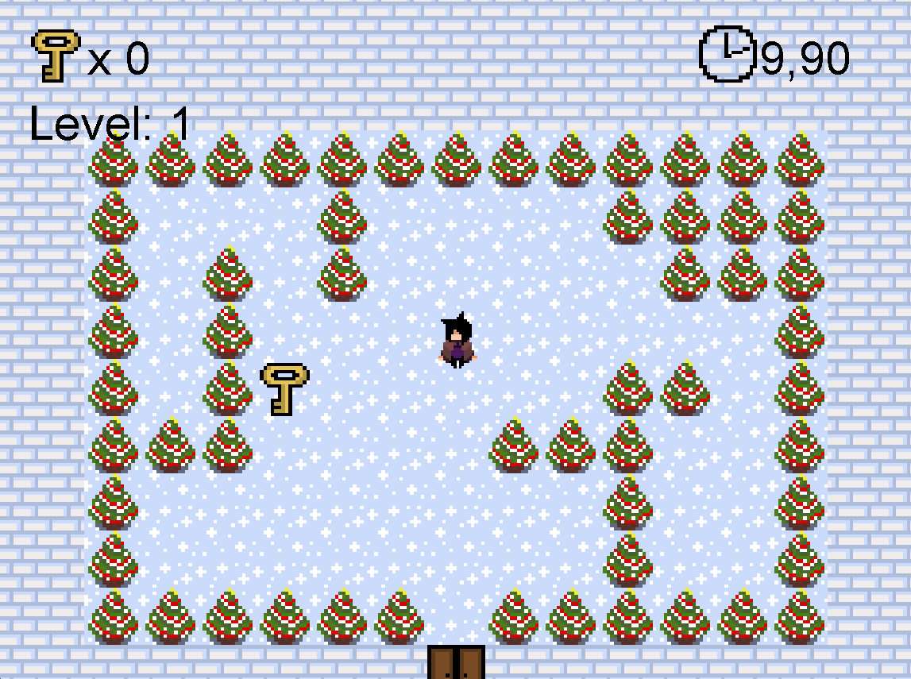

# Maze Game Project

This project is a 2D maze game developed using Java. The game includes various entities, maps, and objects. This README file provides instructions on how to run the project, its structure, and some screenshots from the game.

## Table of Contents

- [Installation](#installation)
- [Usage](#usage)
- [Project Structure](#project-structure)
- [Map Creation Script](#map-creation-script)
- [Screenshots](#screenshots)

## Installation

Follow these steps to set up the project:

1. Clone this repository:
    ```sh
    git clone https://github.com/yourusername/maze-game-project.git
    ```
2. Navigate to the project directory:
    ```sh
    cd maze-game-project/maze_game
    ```
3. Install the necessary dependencies and compile the project.

## Usage

To run the project, follow these steps:

1. Run the `src/main/Main.java` file.

## Project Structure

The project has the following structure:


- `src/`: Directory containing the source code.
- `res/`: Directory containing game resources (images, sounds, etc.).
- `bin/`: Directory containing compiled class files.

## Map Creation Script

This project contains a set of scripts designed to facilitate map creation for your game project. Below is an explanation of how to use these scripts.

### Requirements

First, you can install the necessary dependencies using the `requirements.txt` file. Simply run the following command:

```sh
pip install -r map_designer/pic_draw_converter/requirements.txt
```

### Usage

#### 1. Converting Image to Matrix

The `pic_matris_converter` directory contains the `pic_to_matrix.py` script, which converts an image to matrix format. Follow these steps to run the script:

1. Replace the `input_image.png` file with the image you want to convert.
2. Run the following command:

```sh
python map_designer/pic_matris_converter/pic_to_matrix.py
```

This command will read the `input_image.png` file and save it as a matrix in the `output_matrix.txt` file.

#### 2. Drawing Image from Matrix

The `pic_draw_converter` directory contains the `paint_program.py` script, which converts a matrix to image format. Follow these steps to run the script:

1. Replace the `matrix.txt` file with the matrix you want to convert.
2. Run the following command:

```sh
python map_designer/pic_draw_converter/paint_program.py
```

This command will read the `matrix.txt` file and create an image in the specified format.

### File Structure

- `map_designer/pic_draw_converter/`
  - `matrix.txt`: The matrix file you want to convert.
  - `paint_program.py`: The script used for drawing an image from a matrix.
  - `requirements.txt`: The file containing necessary dependencies.
- `map_designer/pic_matris_converter/`
  - `input_image.png`: The image file you want to convert.
  - `output_matrix.txt`: The converted matrix file.
  - `pic_to_matrix.py`: The script used for converting an image to a matrix.

By following these steps, you can easily perform the necessary map creation tasks for your game project.

## Screenshots

Here are some screenshots from the game:

### Main Menu

### In-Game Screenshot

